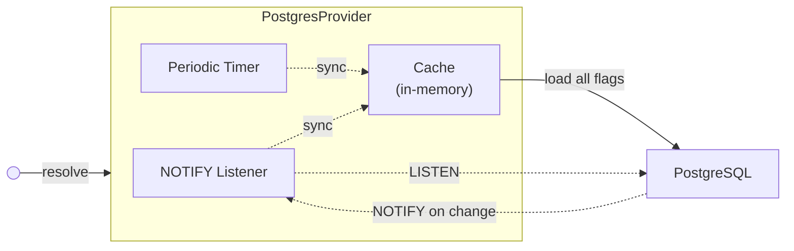

# @quad/openfeature-provider-postgres

A PostgreSQL-backed [OpenFeature](https://openfeature.dev/) provider. Works with
any runtime that supports [`pg`](https://www.npmjs.com/package/pg) (Node.js,
Deno, Bun, etc.).

## How it works

Flags are served from an in-memory cache using a refresh-ahead pattern — the
cache is proactively updated so evaluations never block on a database
round-trip:

1. **LISTEN/NOTIFY** — schema triggers send a Postgres notification on every
   flag change; the provider re-syncs immediately (debounced).
2. **Periodic sync** — a jittered timer re-syncs as a fallback in case a
   notification is missed (e.g. during a connection drop).

Each provider instance holds one dedicated connection from the pool for
`LISTEN`. Size your pool accordingly.



## Pool configuration

Set `statement_timeout` on your pool to prevent hung queries from blocking the
provider indefinitely:

```ts
const pool = new pg.Pool({
  connectionString: "...",
  statement_timeout: 10_000, // 10s
});
```

## License

Apache-2.0
