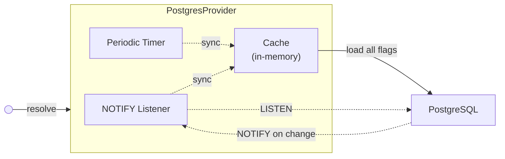

# @quad/openfeature-provider-postgres

[](https://jsr.io/@quad/openfeature-provider-postgres)

A PostgreSQL-backed [OpenFeature](https://openfeature.dev/) provider. Works with
any runtime that supports [`pg`](https://www.npmjs.com/package/pg) (Node.js,
Deno, Bun, etc.).

## How it works

Flags are served from an in-memory cache using a refresh-ahead pattern — the
cache is proactively updated so evaluations never block on a database
round-trip:

1. **LISTEN/NOTIFY** — schema triggers send a Postgres notification on every
   flag change; the provider re-syncs immediately (debounced).
2. **Periodic sync** — a jittered timer re-syncs as a fallback in case a
   notification is missed (e.g. during a connection drop).

Each provider instance holds one dedicated connection from the pool for
`LISTEN`. Size your pool accordingly.



## Targeting

Rows in `openfeature.flag_targeting` define weighted variant distributions. Rows
with `subject IS NULL` are the flag-wide default; rows with a `subject` match
against `EvaluationContext.targetingKey` and resolve with reason
`TARGETING_MATCH`.

```sql
-- Pin one targeting key to a variant.
INSERT INTO openfeature.flag_targeting
  (flag_key, subject, flag_type, variant, weight)
VALUES ('my-flag', 'user-42', 'string', 'beta', 1);
```

See [`examples/basic.ts`](./examples/basic.ts) for a runnable walkthrough.

## Database setup

Apply [`schema.sql`](./schema.sql) once to bootstrap. For version bumps that
change the schema, apply the matching script in [`migrations/`](./migrations)
before deploying.

```sh
psql "$DATABASE_URL" -f schema.sql                       # initial install
psql "$DATABASE_URL" -f migrations/0.2.0-to-0.3.0.sql    # upgrading
```

## Pool configuration

Set `statement_timeout` on your pool to prevent hung queries from blocking the
provider indefinitely:

```ts
const pool = new pg.Pool({
  connectionString: "...",
  statement_timeout: 10_000, // 10s
});
```

## License

Apache-2.0
